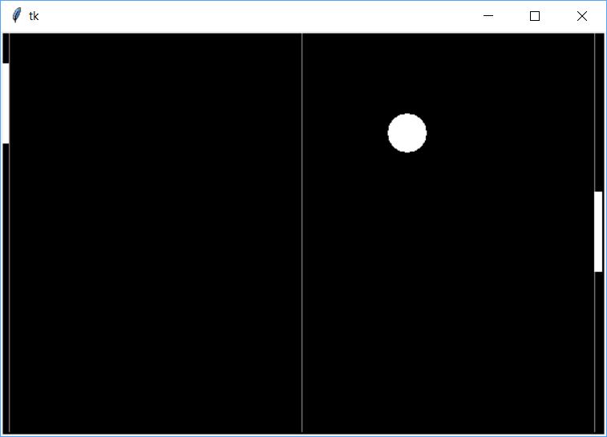

# yappg
Yet Another Python Pong Game

Implemented as Python exercise project way back. No active development.

## Requirements
- Python 3

## Usage
- Key mapping: 
  - Left player: W (up), S (down)
  - Right player: UP (up), DOWN (down)
